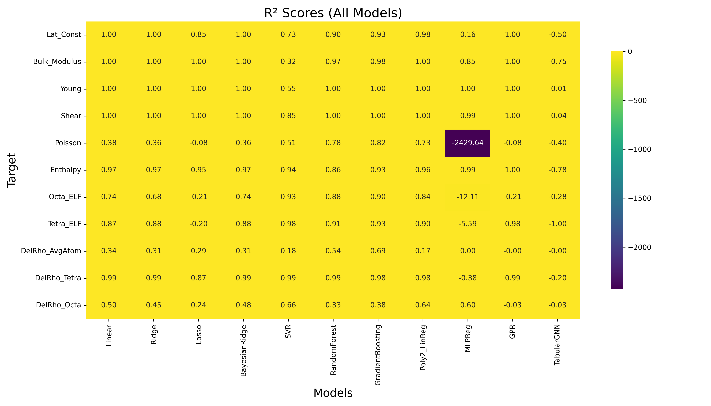
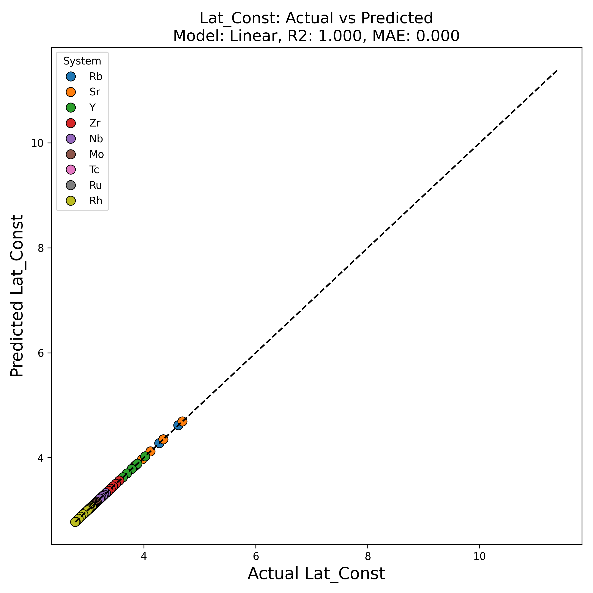
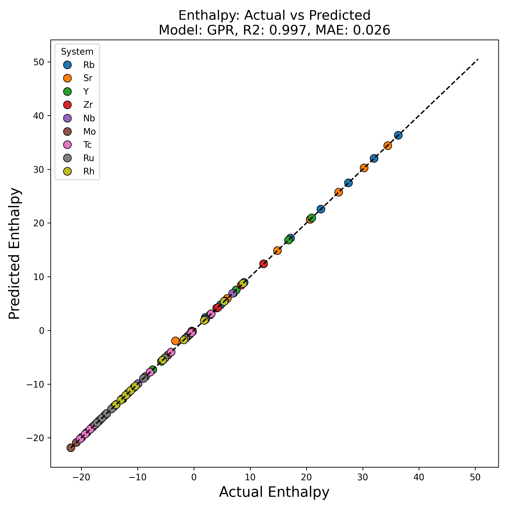
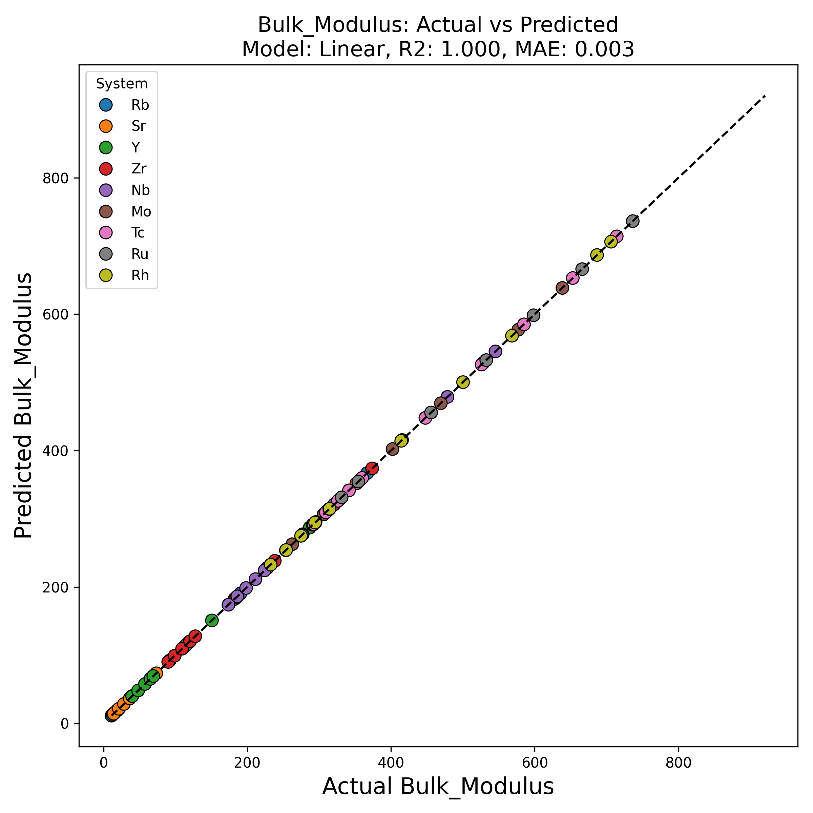
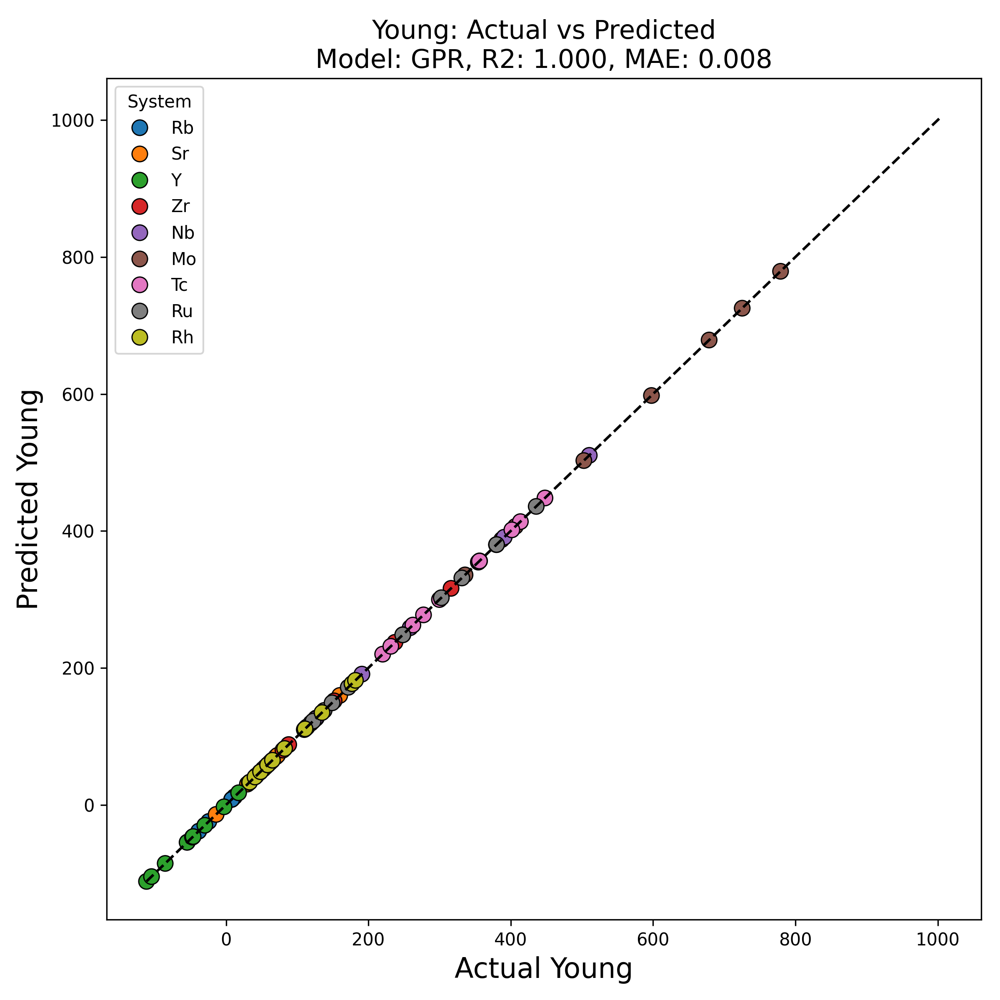
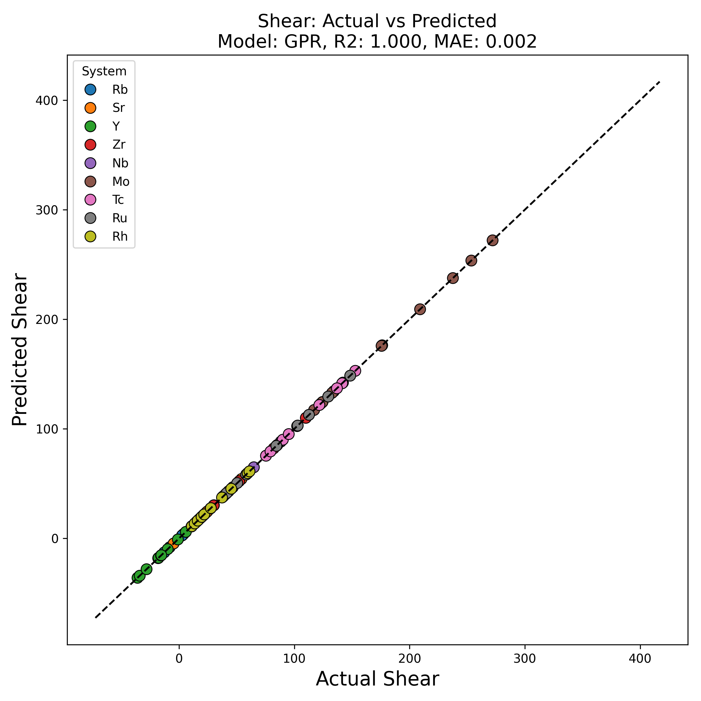
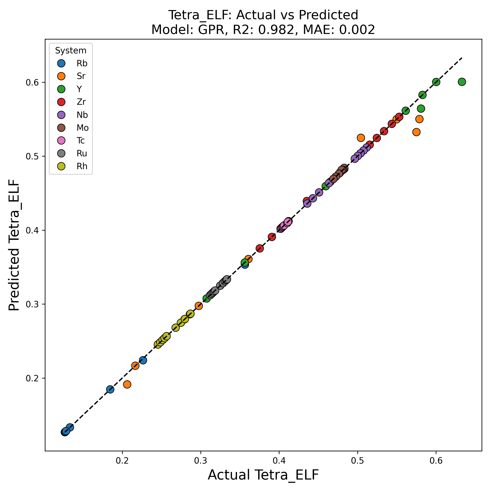
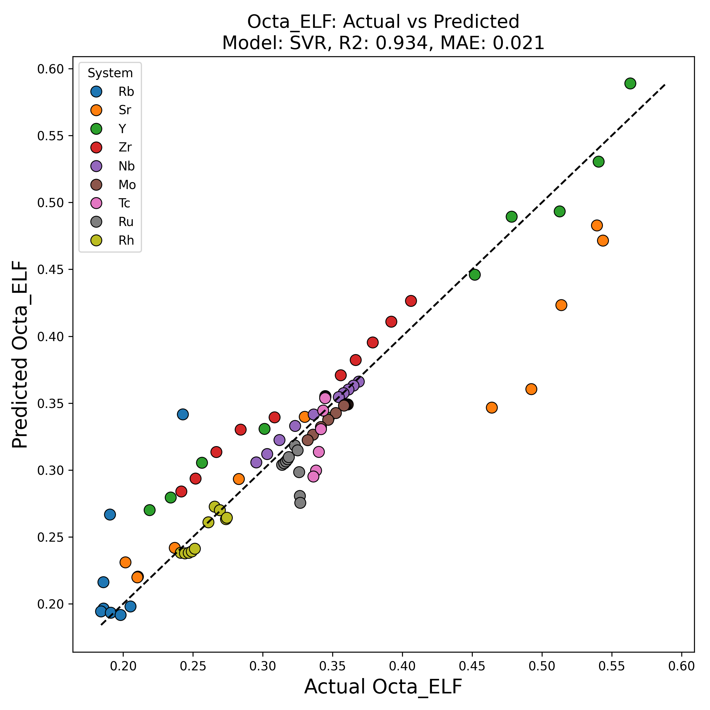
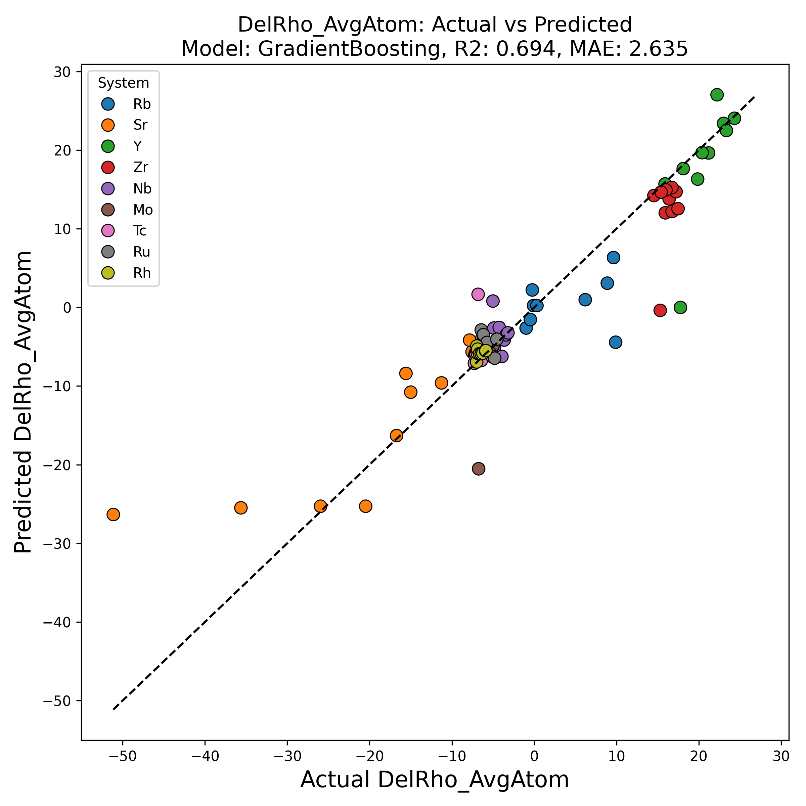
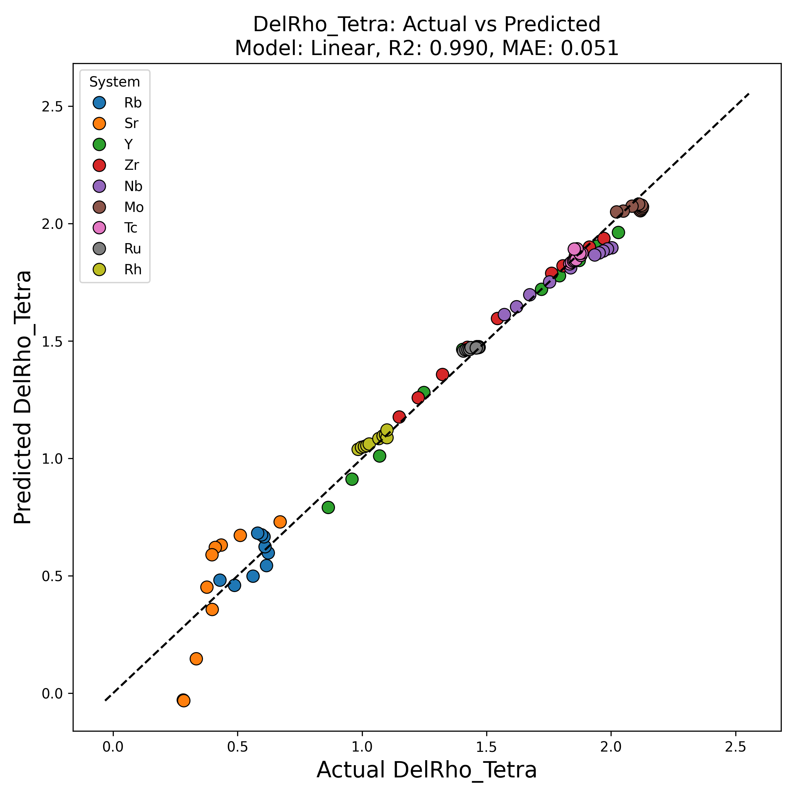

# ML-Driven-Material-Properties-Prediction

This repository investigates the regression of elastic and electronic properties of Period 5 metals using supervised learning.

## Project Overview

The core objective of this project is to leverage machine learning techniques to predict complex material properties, specifically:
* **Elastic properties**: Lattice Constant, Bulk Modulus, Young's Modulus, Shear Modulus, and Poisson's Ratio.
* **Electronic/Chemical properties**: Enthalpy, Electron Localization Function (ELF) (Octahedral and Tetrahedral), and Charge Density (Average, Tetrahedral, and Octahedral).

The project demonstrates a robust ML workflow, including feature correlation analysis, model selection, training, evaluation, and prediction, even for pressures beyond the initial training data.

## Features and Dataset

The dataset used in this study comprises a total of 28 features derived from Density Functional Theory (DFT) calculations of Period 5 metals (Rb, Sr, …, Rh in bcc phase). These features capture both structural and electronic characteristics of the materials.

**Key Features Include:**
* **Structural/Atomic:** Atomic number, Lattice Constant, Volume, Bond Length, Wigner-Seitz Radius ($R_{wigs}$).
* **Energetic:** Energy, Enthalpy, Fermi Energy ($E_{fermi}$).
* **Elastic Constants:** $C_{11}$, $C_{12}$, $C_{44}$.
* **Mechanical Moduli:** Bulk Modulus, Young's Modulus, Shear Modulus, Poisson's Ratio.
* **Electronic Structure:** Total, s, p, d, f valence electrons ($Val\_e\_tot$, $Val\_e\_s$, $Val\_e\_p$, $Val\_e\_d$, $Val\_e\_f$), Average Charge Density ($\Delta\rho_{avg}$), Tetrahedral Charge Density ($\Delta\rho_{Tet}$), Octahedral Charge Density ($\Delta\rho_{Oct}$), Bader Charge ($Bader\_Ch$).
* **Electron Localization Function (ELF):** Average ELF ($ELF_{avg}$), Tetrahedral ELF ($ELF_{Tet}$), Octahedral ELF ($ELF_{Oct}$).

The primary data is sourced from `elastic_constants_vs_pressure_extended.dat`.

## Machine Learning Workflow

The project follows a systematic machine learning workflow:

1.  **Correlation Matrix Calculation:** The correlation matrix within all features in the dataset is calculated.
2.  **Target Selection:** Targets (y) to be predicted as a function of pressure (x) are selected, including Lattice constant, Enthalpy, Bulk modulus, ELF, and Charge density.
3.  **Feature Selection:** For each target prediction, features that have a high correlation (e.g., absolute value > 0.5) are selected.
4.  **Model Training:** Several ML models are used for training the dataset for each target.
5.  **Accuracy Evaluation:** Accuracy parameters (e.g., R², MAE) of each ML model are calculated for corresponding targets.
6.  **Best Model Selection:** The best ML model is used for the corresponding target prediction.

## Implemented ML Models

A variety of regression models were tested for their predictive power:
* Linear Regression
* Ridge Regression
* Lasso Regression
* Bayesian Ridge Regression
* Support Vector Regressor (SVR)
* Random Forest Regressor
* Gradient Boosting Regressor
* Polynomial Regression (degree 2, via PolynomialFeatures + LinearRegression)
* Multi-layer Perceptron (MLP) Regressor
* Gaussian Process Regressor (GPR)
* Tabular Graph Neural Network (Tabular GNN)

## Results

The performance of the models is summarized in the $R^2$ score heatmap and individual actual vs. predicted plots for each target.

### $R^2$ Scores (All Models)

The heatmap below shows the $R^2$ scores for all tested models across different targets. Higher values (closer to 1.00) indicate better model performance.



### Analysis of Results

The machine learning models developed in this project demonstrate a strong capability in predicting various elastic and chemical properties of Period 5 metals under pressure. The analysis primarily relies on the coefficient of determination ($R^2$) and Mean Absolute Error (MAE) as performance metrics, along with visual inspection of actual versus predicted plots.

* **High Predictability of Elastic Properties:**
    * **Lattice Constant, Bulk Modulus, Young's Modulus, and Shear Modulus** show exceptionally high predictability. Several models, including Linear Regression, Ridge, Bayesian Ridge, Random Forest, and Gradient Boosting, consistently achieve R² scores of 1.00 or very close to it (e.g., 0.97-1.00). This indicates that these models can explain almost all the variance in these properties, suggesting a strong underlying linear or non-linear relationship with the selected features.
    * The consistently high R² values for these elastic properties across multiple simple models (Linear, Ridge) suggest that the relationship between these properties and the chosen features is quite direct and well-captured by linear or slightly more complex linear models.

* **Predictability of Electronic and Chemical Properties:**
    * **Enthalpy** is also predicted with very high accuracy, with several models yielding R² scores above 0.95 (e.g., Linear, Ridge, Lasso, Bayesian Ridge, Gradient Boosting, GPR).
    * **Tetrahedral ELF ($Tetra\_ELF$)** also exhibits good predictability, with R² scores generally above 0.85 for most models, and as high as 0.98 for GPR and Gradient Boosting.
    * **Octahedral ELF ($Octa\_ELF$)** shows slightly more variability but still achieves R² scores above 0.70 for many models, with SVR, Random Forest, and Gradient Boosting performing well (0.93-0.90).
    * **Tetrahedral Charge Density ($\Delta\rho_{Tet}$)** and **Octahedral Charge Density ($\Delta\rho_{Oct}$)** are predicted reasonably well, with $\Delta\rho_{Tet}$ showing R² values up to 0.99 (Linear, Ridge, Bayesian Ridge, Random Forest, Gradient Boosting, Poly2\_LinReg, GPR). $\Delta\rho_{Oct}$ has lower R² scores (max 0.66 for SVR, Random Forest, Gradient Boosting, MLPReg, GPR), indicating that its prediction is more challenging compared to other properties.

* **Challenging Predictions:**
    * **Poisson's Ratio** and **Average Charge Density ($\Delta\rho_{AvgAtom}$)** appear to be the most challenging properties to predict accurately based on the current feature set and models. Poisson's Ratio has highly variable R² scores, even showing large negative values for MLP Regressor (-2429.64) and Tabular GNN (-3.03), indicating that these models perform worse than a simple mean prediction. Similarly, $\Delta\rho_{AvgAtom}$ generally has lower R² scores, with the highest being 0.69 for Gradient Boosting. This suggests that the chosen features might not fully capture the driving factors for these properties, or their relationship is highly non-linear and requires more sophisticated modeling or additional feature engineering.

* **Model Performance Consistency:**
    * **Linear models (Linear, Ridge, Bayesian Ridge, Poly2\_LinReg)** generally perform very well for elastic properties, indicating that a relatively simple linear relationship exists between these properties and the selected features.
    * **Ensemble methods (Random Forest, Gradient Boosting)** consistently perform strongly across most targets, often achieving high R² scores, which highlights their robustness and ability to capture complex relationships.
    * **Gaussian Process Regressor (GPR)** also shows strong performance for several targets, including Enthalpy, Young's Modulus, and Tetrahedral ELF.
    * **SVR** demonstrates good performance for Octahedral ELF and some elastic properties.
    * **Tabular GNN** and **MLP Regressor** show mixed results. While they perform well for some targets, they struggle significantly with others (e.g., Poisson's ratio), suggesting that their hyperparameters or architecture might need further tuning for this specific dataset or that the inherent complexity of these models might lead to overfitting or poor generalization on smaller or less complex datasets.

### Selected Actual vs. Predicted Plots

Visualizations of actual vs. predicted values for key properties are provided in the `results/` directory. Examples include:

* **Lattice Constant:**
    
* **Enthalpy:**
    
* **Bulk Modulus:**
    
* **Young's Modulus:**
    
* **Shear Modulus:**
    
* **Tetrahedral ELF:**
    
* **Octahedral ELF:**
    
* **Average Charge Density:**
    
* **Tetrahedral Charge Density:**
    
* **Octahedral Charge Density:**
    

These plots demonstrate the high accuracy of the predictions, with most points closely following the ideal $y=x$ line.

### Summary of Key Findings

* Elastic properties (e.g., bulk modulus, lattice constant) are driven by both structural (pressure, volume, bond length) and electronic (E_fermi, RWIGS, valence electron) features.
* Electronic properties (ELF, charge density) are influenced by local structure and electronic descriptors.

## How to Run the Code

To replicate the results, follow these steps:

1.  **Clone the repository:**
    ```bash
    git clone [https://github.com/yourusername/ML-Driven-Material-Properties-Prediction.git](https://github.com/yourusername/ML-Driven-Material-Properties-Prediction.git)
    cd ML-Driven-Material-Properties-Prediction
    ```

2.  **Create a virtual environment (recommended):**
    ```bash
    python -m venv venv
    source venv/bin/activate  # On Windows: venv\Scripts\activate
    ```

3.  **Install dependencies:**
    ```bash
    pip install -r requirements.txt
    ```

4.  **Run the main script:**
    ```bash
    python ml_test.py
    ```
    This script will perform the ML analysis, generate plots, and save results in the `results/` directory.

## Dependencies

The necessary Python libraries are listed in `requirements.txt`:

* pandas
* numpy
* matplotlib
* seaborn
* scikit-learn
* torch
* torch_geometric

## Outlook

* Explore more advanced feature engineering techniques to improve predictions for properties like Poisson's Ratio and average charge density.
* Incorporate uncertainty quantification in predictions to provide more robust estimates.
* Test with a wider range of materials and phases to generalize the models.
* Optimize GNN architecture and training for tabular data, especially given its mixed performance in this study.
* Investigate the physical reasons behind the lower predictability of certain properties.


## Contact
Abhiyan Pandit
https://www.linkedin.com/in/abhiyan-pandit-a8838a138/
abhi99lucky@gmail.com

